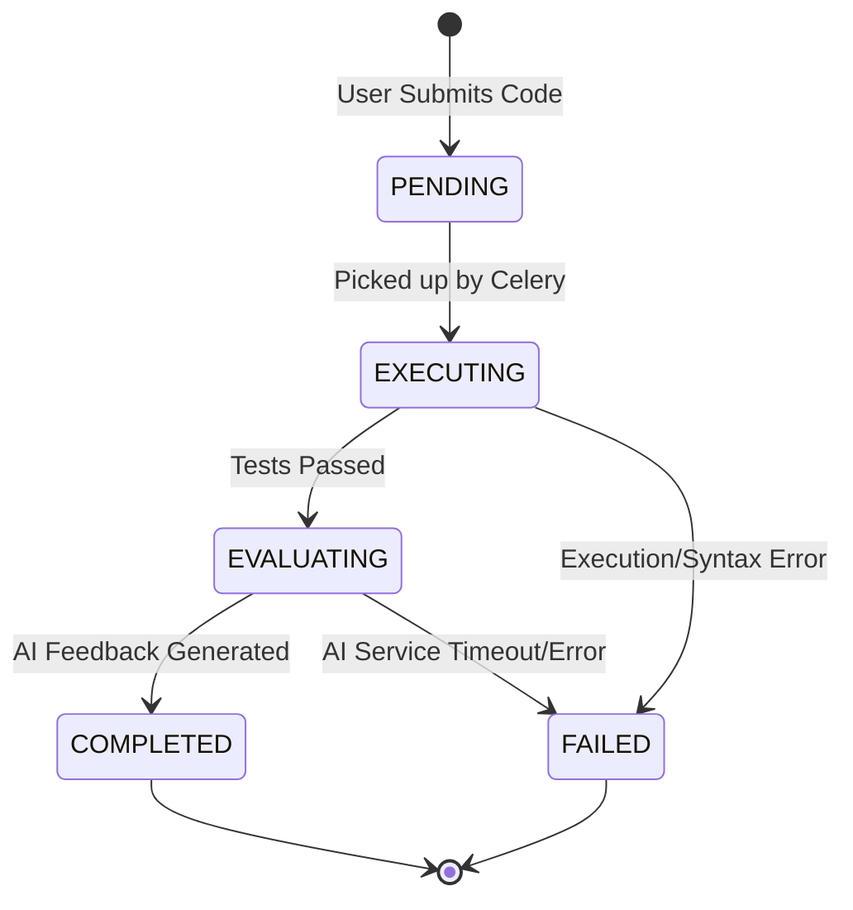
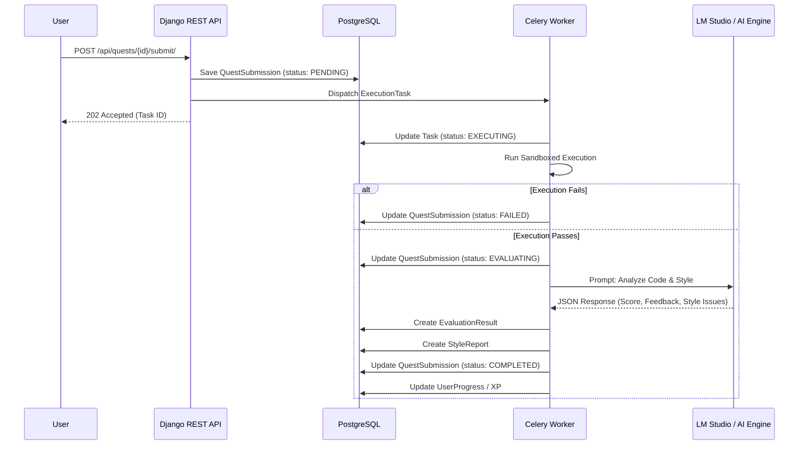
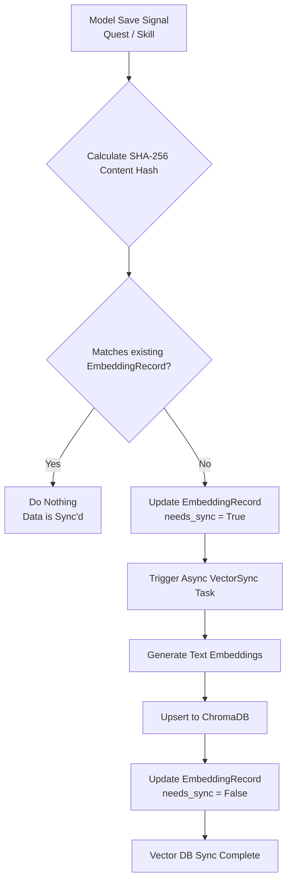
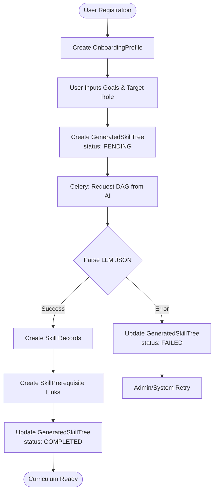

# SkillTree AI Database & Architecture Visualizations

This document provides system-level visualizations of the core workflows, state machines, and data pipelines in the SkillTree AI architecture. It complements the structural models defined in `DATABASE_SCHEMA.md` and the relationships in `ERD.md` by showing how data moves over time.

## 1. Quest Submission State Machine

The lifecycle of a `QuestSubmission` is strictly managed by state transitions. It begins when a user submits code and moves through asynchronous execution and AI evaluation.

## 2. AI Evaluation Sequence Pipeline

This sequence diagram illustrates the integration between Django, the asynchronous task queue (Celery), the local LLM (LM Studio), and PostgreSQL during a code evaluation.

## 3. Vector Database Synchronization Workflow

SkillTree AI uses ChromaDB for semantic search across skills and quests. To maintain synchronization between relational PostgreSQL data and the vector store, we use an event-driven hash-checking mechanism via the `EmbeddingRecord` model.

## 4. Onboarding & Skill Tree Generation Flow

The dynamic generation of learning paths (DAGs) involves creating root configurations, contacting the LLM to generate the curriculum, and parsing the output into relational `Skill` and `SkillPrerequisite` models.

