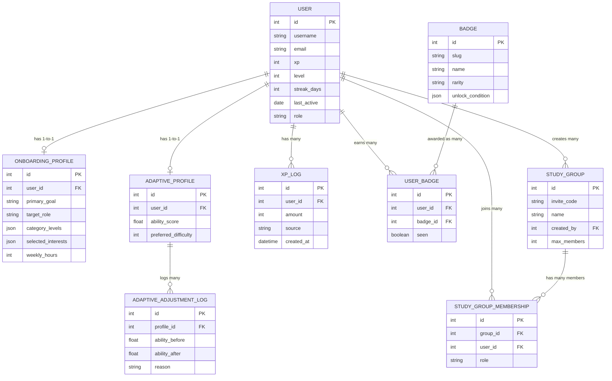
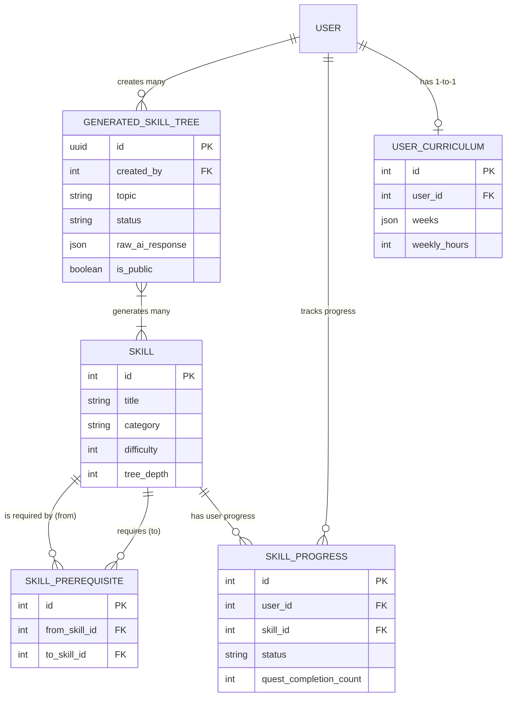
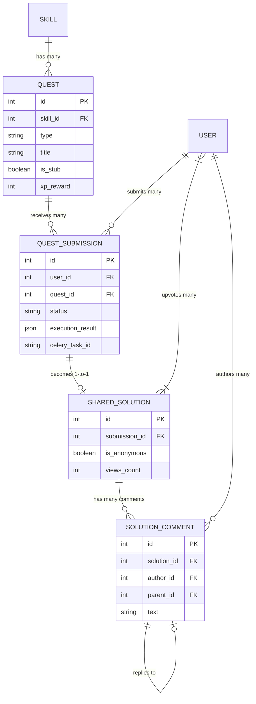
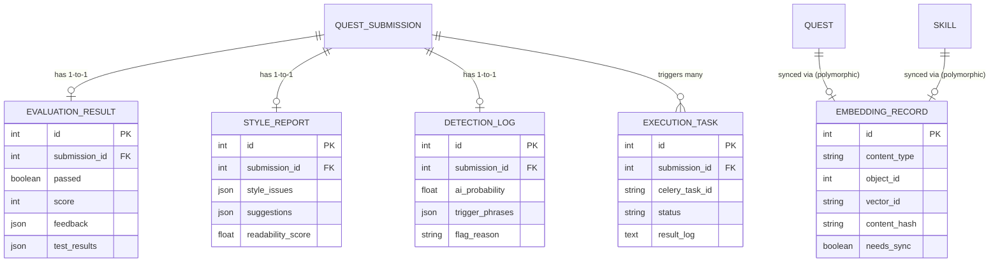

# SkillTree AI Entity Relationship Diagrams

This document visualizes the database relationships across the different systems within SkillTree AI.

## 1. User Systems

The User Systems domain manages identity, progression (XP/Level), gamification (badges), collaborative groups, and onboarding profiles.

## 2. Skill Tree Systems

The Skill Tree Systems domain manages the DAG (Directed Acyclic Graph) of skills, AI-generated trees, user progression tracking, and dynamically generated curricula.

## 3. Quest Systems

The Quest Systems domain tracks individual learning challenges, user submissions, execution results, and peer-reviewed shared solutions.

## 4. AI & Vector DB Systems

This domain tracks background asynchronous processing (execution and AI generation), AI-driven qualitative feedback, LLM detection, and the relational bridge to the ChromaDB vector store.

