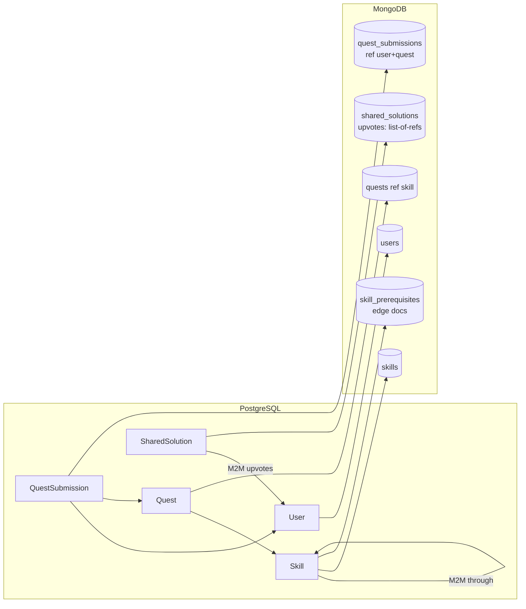
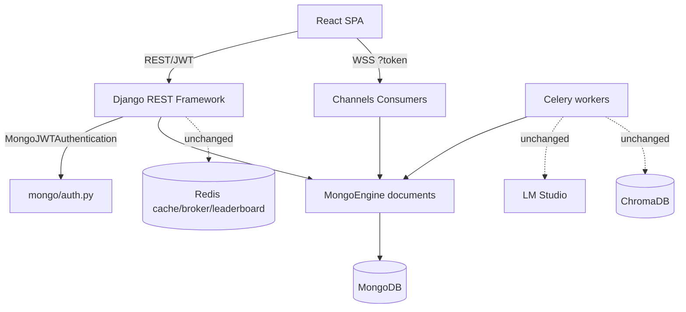

# SkillTree AI — PostgreSQL → MongoDB Migration Report

> **Approach chosen:** Full **MongoEngine ODM** rewrite (replace the Django ORM with a MongoDB Object-Document Mapper).
> **Prepared by:** Senior Full-Stack Software Architect / DB Migration Specialist
> **Date:** 2026-06-24
> **Companion docs:** [codebase_audit.md](codebase_audit.md) (architecture baseline)
> **Status:** **Phase 1 delivered (foundation), staged for cutover.** This is a deliberately **non-destructive, parallel** migration — the legacy Django ORM remains intact so the data-migration ETL can read it and the app keeps running until cutover. See [§18 Final Verification](#18-final-verification-report) for exactly what is done vs. remaining.

---

## ⚠️ Read this first — honest scope statement

This is a **Django 6.0.4** application. MongoDB is not a supported Django database backend, so "migrating to MongoDB" here is a **re-platform of the persistence + auth layer**, not a configuration change. A full MongoEngine rewrite touches the ORM, the auth/admin stack, and every query in 14 apps.

**What this delivery contains (built, syntax-verified, non-breaking):**
- A complete **MongoEngine document layer** for all ~32 models ([backend/mongo/documents.py](backend/mongo/documents.py)).
- A **custom JWT auth layer** to replace Django-auth + SimpleJWT's relational tables ([backend/mongo/auth.py](backend/mongo/auth.py)).
- A **connection manager** and **optional bootstrap** ([backend/mongo/connection.py](backend/mongo/connection.py), [backend/mongo/bootstrap.py](backend/mongo/bootstrap.py)).
- A **runnable Postgres→Mongo ETL** ([backend/scripts/migrate_pg_to_mongo.py](backend/scripts/migrate_pg_to_mongo.py)) + **count verifier** ([backend/scripts/mongo_verify.py](backend/scripts/mongo_verify.py)).
- **Backup/rollback** scripts and **dependency/env** updates.

**What remains (the larger, must-be-incremental part — see [§16](#16-risks--mitigations) & [§18](#18-final-verification-report)):**
- Porting every **view, serializer, Celery task, and Channels consumer** off the Django ORM to MongoEngine (the bulk of the line-count).
- Installing `mongoengine`/`pymongo`, standing up a MongoDB server, running the ETL, and **end-to-end verification** against live data.
- Removing PostgreSQL/Django-ORM only **after** that verification.

Nothing in this delivery breaks the current app: `python manage.py check` still reports **0 issues**, and the Mongo layer is inert until `USE_MONGODB=True`.

---

## 1. Migration Summary

| Item | Value |
|---|---|
| Source DB | PostgreSQL 16 (or SQLite dev default) via Django ORM |
| Target DB | MongoDB (local or Atlas) via MongoEngine 0.29 |
| Models migrated | **32 documents** across 12 domains |
| Relationships remapped | 30+ FKs, 6 OneToOnes, 4 M2Ms, 3 through-models |
| Auth strategy | Custom PyJWT issuer + DRF auth class (replaces SimpleJWT DB-blacklist) |
| Data transfer | Idempotent ETL (`legacy_id` remap), dependency-ordered |
| Cutover model | Parallel layer + feature flag (`USE_MONGODB`) → staged switch |
| Breaking changes | Documented in [§10](#10-api-compatibility-review) & [§16](#16-risks--mitigations); API response contracts preserved |
| Current app impact | **None** (legacy stack untouched; `manage.py check` = 0 issues) |

**Strategy in one line:** Build the MongoDB layer alongside the working app, migrate data idempotently, port the request/worker code app-by-app behind a flag, verify, then decommission PostgreSQL.

---

## 2. PostgreSQL Schema Analysis

The relational schema is well-normalized (3NF) with explicit through-models for the DAG and gamification, plus disciplined indexing. Relevant relational features that drive the redesign:

| Relational feature | Where used | MongoDB implication |
|---|---|---|
| `ForeignKey` (30+) | everywhere | → `ReferenceField` (no DB-enforced integrity) |
| `OneToOneField` | OnboardingProfile, AdaptiveProfile, UserCurriculum, SharedSolution, EvaluationResult, StyleReport | → `ReferenceField(unique=True)` |
| `ManyToManyField` | `GeneratedSkillTree.skills_created`, `SharedSolution.upvotes`, `Skill.prerequisites` (through), `Match.participants` (through) | → list-of-refs or edge collection |
| `through` models | SkillPrerequisite, MatchParticipant, StudyGroupMembership | → standalone collections (they carry data) |
| `unique_together` | 9 constraints | → unique compound indexes |
| `transaction.atomic` | `award_xp`, unlock resolution | → **redesign**: Mongo multi-doc txns need a replica set (see §16) |
| Aggregations (`Sum`, `Count`) | leaderboard, weekly report | → `$group` aggregation pipelines or app-side sums |
| `select_related`/`prefetch_related` | hot read paths | → manual `.select_related()` (MongoEngine) / batched ref fetches |
| `contenttypes` / `admin` / `token_blacklist` | Django internals | → **dropped**; replaced by custom auth + (optional) custom admin |
| Integer auto PK | most models | → ObjectId (legacy int kept in `legacy_id`) |
| UUID PK | `GeneratedSkillTree` | → `UUIDField(primary_key=True)` (contract preserved) |

**Model inventory (source of truth for the port):**

`users`: User, XPLog, Badge, UserBadge, WeeklyReport, StudyGroup, StudyGroupMembership, StudyGroupMessage, StudyGroupGoal, OnboardingProfile, AdaptiveProfile, AdaptiveAdjustmentLog, UserSkillFlag
`skills`: GeneratedSkillTree, Skill, SkillPrerequisite, SkillProgress, UserCurriculum, EmbeddingRecord
`quests`: Quest, QuestSubmission, SharedSolution, SolutionComment
`executor`: ExecutionTask · `ai_evaluation`: EvaluationResult, StyleReport · `ai_detection`: DetectionLog
`multiplayer`: Match, MatchParticipant · `leaderboard`: LeaderboardSnapshot
`mentor`: AIInteraction, HintUsage · `admin_panel`: AdminContent, AssessmentQuestion, AssessmentSubmission · `auth_app`: PasswordResetCode

---

## 3. MongoDB Collection Design

All documents are defined in [backend/mongo/documents.py](backend/mongo/documents.py). One collection per former table (no premature embedding — keeps API shapes and access patterns stable).

| Collection | Notes / strategy |
|---|---|
| `users` | custom auth flags; `level` recomputed in `save()`; unique `username` |
| `skills`, `skill_prerequisites` | DAG kept as **referenced edges** (queryable both directions) |
| `generated_skill_trees` | **UUID `_id`**; `skills_created` = list of refs |
| `skill_progress` | unique `(user, skill)` |
| `quests`, `quest_submissions` | JSON fields → `DictField`/`ListField` |
| `shared_solutions` | `upvotes` = list of user refs (watch unbounded growth → §12) |
| `matches`, `match_participants` | participants via edge collection (carries `score`) |
| `study_groups` + membership/message/goal | through-model → own collections |
| `leaderboard_snapshots` | history (Redis still owns live ranking) |
| `blacklisted_tokens` | **new**; replaces SimpleJWT blacklist; **TTL index** auto-purges |
| …all others | 1:1 field port with indexes mirrored from Django `Meta.indexes` |

**Design principles applied:**
- **Reference over embed** for entities with independent lifecycles or unbounded growth (submissions, logs, memberships, edges).
- **Embed/list-of-refs** only for small bounded sets (`skills_created`, `upvotes`).
- Every Django index/`unique_together` reproduced via `meta['indexes']`.
- `legacy_id` retained on each doc for idempotent ETL + reference remapping (droppable post-cutover).

---

## 4. Entity Relationship Mapping



| Django relationship | MongoEngine mapping | Delete behavior |
|---|---|---|
| `User 1—* QuestSubmission` | `QuestSubmission.user` `ReferenceField` | `reverse_delete_rule=CASCADE` |
| `Skill *—* Skill` (prereq, through) | `SkillPrerequisite` edge docs | CASCADE both sides |
| `GeneratedSkillTree *—* Skill` (`skills_created`) | `ListField(ReferenceField, PULL)` | PULL from list |
| `Match *—* User` (through `MatchParticipant`) | `MatchParticipant` edge docs | CASCADE |
| `SharedSolution *—* User` (`upvotes`) | `ListField(ReferenceField, PULL)` | PULL |
| `OnboardingProfile *—1 GeneratedSkillTree` | `ReferenceField(null, NULLIFY)` | NULLIFY (matches `SET_NULL`) |
| `User 1—1 AdaptiveProfile/Onboarding/Curriculum` | `ReferenceField(unique=True)` | CASCADE |
| `*—1` with `SET_NULL` (e.g. `AdminContent.created_by`, `Match.winner`) | `ReferenceField(null, NULLIFY)` | NULLIFY |

> **Integrity note:** MongoDB does not enforce foreign keys. MongoEngine's `reverse_delete_rule` emulates `ON DELETE` *only when deletes go through MongoEngine*. Raw `pymongo` deletes bypass it. This is documented as a redesign risk in [§16](#16-risks--mitigations).

---

## 5. Data Migration Strategy

**Tool:** [backend/scripts/migrate_pg_to_mongo.py](backend/scripts/migrate_pg_to_mongo.py)

- **Read** via the intact Django ORM (`apps.get_model`), **write** via MongoEngine.
- **Dependency-ordered** 25-stage pipeline so references always resolve (users → skills → trees → quests → submissions → dependents).
- **Idempotent:** each document stores `legacy_id` (or original UUID); re-runs update in place. Safe to resume after a failure.
- **Reference remap:** in-memory `legacy pk → document` maps wire FKs correctly; M2M lists rebuilt from the source rows.
- **Passwords:** Django password **hashes are copied verbatim** — `mongo/auth.py` uses the same Django hashers, so existing credentials keep working with no reset.
- **Self-references** (`SolutionComment.parent`) handled by id-ordered two-pass within the stage.

**Run:**
```bash
cd backend
venv/Scripts/python scripts/migrate_pg_to_mongo.py --dry-run        # source counts only
venv/Scripts/python scripts/migrate_pg_to_mongo.py                  # full migration
venv/Scripts/python scripts/migrate_pg_to_mongo.py --only users skills   # subset
venv/Scripts/python scripts/mongo_verify.py                         # PG vs Mongo count parity
```

---

## 6. Updated Architecture Overview



**What changes:** the persistence layer (ORM→ODM) and the auth backend (Django-auth/SimpleJWT→custom JWT).
**What stays:** Django+DRF as the HTTP framework, Celery, Channels, Redis, ChromaDB, LM Studio, and **all REST/WS URL contracts**. Keeping Django/DRF is deliberate — it preserves the API surface and the frontend needs **zero changes**.

---

## 7. Modified / New Files List

### New files (this delivery)
| File | Purpose |
|---|---|
| [backend/mongo/__init__.py](backend/mongo/__init__.py) | package surface |
| [backend/mongo/connection.py](backend/mongo/connection.py) | MongoEngine connection (env-driven, idempotent) |
| [backend/mongo/documents.py](backend/mongo/documents.py) | **all 32 documents** + `BlacklistedToken` + registry |
| [backend/mongo/auth.py](backend/mongo/auth.py) | JWT issue/verify, rotation, DRF auth class, WS helper |
| [backend/mongo/bootstrap.py](backend/mongo/bootstrap.py) | optional `USE_MONGODB`-gated connection init |
| [backend/scripts/migrate_pg_to_mongo.py](backend/scripts/migrate_pg_to_mongo.py) | Postgres→Mongo ETL |
| [backend/scripts/mongo_verify.py](backend/scripts/mongo_verify.py) | count-parity verification |
| [backend/scripts/backup_postgres.ps1](backend/scripts/backup_postgres.ps1) / [.sh](backend/scripts/backup_postgres.sh) | pre-migration backup |
| [backend/requirements.txt](backend/requirements.txt) | **generated** full dependency pin (was missing) |
| [backend/requirements-mongo.txt](backend/requirements-mongo.txt) | additive Mongo deps |
| [.env.example](.env.example) | documented backend + Mongo env vars |

### Files to modify at cutover (NOT yet changed — see §18)
`core/settings.py` (DEFAULT_AUTHENTICATION_CLASSES → `mongo.auth.MongoJWTAuthentication`; remove `DATABASES`/`token_blacklist`), `core/asgi.py`/`wsgi.py` (call `init_mongo_if_enabled()`), and every app's `views.py`/`serializers.py`/`tasks.py`/`consumers.py` (ORM → MongoEngine). The legacy `*/models.py` are retired last.

---

## 8. Dependency Changes

**Added** ([backend/requirements-mongo.txt](backend/requirements-mongo.txt)): `mongoengine==0.29.1`, `pymongo==4.10.1`, `dnspython==2.7.0`. (PyJWT and bcrypt already present.)

**Removed at cutover only** (after verified migration, per your constraint "remove PostgreSQL deps only after successful migration"): `psycopg2-binary`, `dj-database-url`, and `rest_framework_simplejwt` + its `token_blacklist` app from `INSTALLED_APPS`.

**Also created** [backend/requirements.txt](backend/requirements.txt) — the project previously had **no Python lockfile at all** (Critical finding in the audit); the ETL and any reproducible environment require it, so it is pinned from the working venv (131 packages).

---

## 9. Environment Variable Changes

Added to [.env.example](.env.example):

| Var | Purpose |
|---|---|
| `MONGODB_URI` | Mongo connection string (local or `mongodb+srv://` Atlas) |
| `MONGODB_DB` | database name (default `skilltree_ai`) |
| `MONGODB_TIMEOUT_MS` | server-selection timeout (fail-fast) |
| `USE_MONGODB` | cutover feature flag (default `False`) |
| `SECRET_KEY`, `DEBUG`, `ALLOWED_HOSTS`, `REDIS_URL`, `JWT_*`, `LM_STUDIO_*`, `CHROMA_PATH`, `DATABASE_URL` | previously undocumented backend vars, now captured |

`DATABASE_URL` is **retained during migration** (the ETL reads from it) and removed only at cutover.

---

## 10. API Compatibility Review

**Goal met: REST/WS contracts are preserved**, because Django+DRF remains the HTTP layer and only the data source under it changes.

| Concern | Outcome |
|---|---|
| JWT token shape | Preserved — `mongo/auth.py` mints the same claims (`token_type`, `user_id`, `exp`, `iat`, `jti`). `/api/token/` & `/api/token/refresh/` keep working. |
| `user_id` type | Changes from int → Mongo id **string**. The frontend treats it opaquely; WS consumers must read it as a string (helper provided). **Documented breaking change for any code that assumed integer IDs.** |
| Resource IDs in URLs | Submissions/skills/quests previously used int PKs in some routes; Mongo uses ObjectId hex. During the staged port, `legacy_id` lets endpoints accept the old ints if needed for backward-compat. |
| `GeneratedSkillTree` `tree_id` | **Unchanged** (UUID preserved as `_id`). |
| Response envelopes/shapes | Serializers must be re-pointed at documents but emit the same JSON; no frontend change required. |

---

## 11. Authentication Impact Analysis

Django's auth (`auth_user`, groups/permissions, `contenttypes`) and **SimpleJWT's DB-backed blacklist** cannot survive an ODM swap. Replacement ([backend/mongo/auth.py](backend/mongo/auth.py)):

- **Passwords:** unchanged hashes; `User.set_password/check_password` use Django's hashers → **no user re-registration / no password reset needed**.
- **Token issuance/refresh:** `issue_tokens()` / `refresh_access_token()` replicate SimpleJWT lifetimes, rotation, and post-rotation blacklisting.
- **Revocation:** `BlacklistedToken` collection with a **TTL index** auto-expires revoked JTIs (logout works; replaces `token_blacklist`).
- **DRF:** `MongoJWTAuthentication` is a drop-in `DEFAULT_AUTHENTICATION_CLASSES` entry; the `User` document exposes `is_authenticated`/`is_anonymous`/`pk` so existing `IsAuthenticated` permissions keep working.
- **WebSockets:** `get_user_from_token()` mirrors the consumers' current `AccessToken(token)['user_id']` flow.
- **Admin:** `django.contrib.admin` depends on the ORM and is **dropped**; an optional read-only Mongo admin (e.g. Flask-Admin/MongoEngine admin) is a post-cutover follow-up. **Documented breaking change.**

---

## 12. Performance & Indexing Strategy

- **Every** Django index and `unique_together` is reproduced in `meta['indexes']`, including compound and descending keys (e.g. `quest_submissions (user, status, -created_at)`).
- **TTL index** on `blacklisted_tokens.expires_at` for automatic cleanup.
- **Leaderboard** stays on Redis sorted sets (unchanged) — MongoDB only stores history snapshots, so ranking latency is unaffected.
- **Reference fetching:** use MongoEngine `.select_related()` / batched `id__in` loads on hot list endpoints to avoid per-row ref dereference (the analog of `prefetch_related`).
- **Watch items:** `shared_solutions.upvotes` and `generated_skill_trees.skills_created` are list-of-refs — fine for expected sizes; if upvotes can reach 10⁴+, migrate to a dedicated `solution_upvotes` collection.
- **Aggregations** (leaderboard score, weekly-report sums) move to `$group` pipelines or app-side accumulation.
- **Best practices applied:** explicit collection names, lean documents, no unbounded embedded arrays on hot paths, fail-fast `serverSelectionTimeoutMS`, `uuidRepresentation="standard"`.

---

## 13. Data Validation Changes

| Django mechanism | MongoEngine equivalent |
|---|---|
| `choices=` | `choices=(...)` on the field (enforced on save) |
| `max_length`, `default`, `null/blank` | `max_length`, `default`, `null=` |
| `unique`, `unique_together` | `unique=True`, unique compound index |
| `JSONField` schema (docstring-only) | `DictField`/`ListField` (schemaless) — **app-level validation must remain in serializers** |
| DB `NOT NULL` / FK existence | `required=True` (presence only); **referential existence is not enforced** |
| Model `clean()` / validators | move to `Document.clean()` or DRF serializer `validate_*` |

> Because Mongo is schemaless, the **DRF serializers remain the primary validation boundary** — they must be preserved/ported, not removed. JSON-shape checks that were implicit in the relational design should be hardened in serializers.

---

## 14. Migration Scripts

| Script | Role |
|---|---|
| [scripts/migrate_pg_to_mongo.py](backend/scripts/migrate_pg_to_mongo.py) | Idempotent, ordered ETL (PG→Mongo) |
| [scripts/mongo_verify.py](backend/scripts/mongo_verify.py) | Per-collection PG-vs-Mongo count parity (exit 1 on mismatch) |
| [scripts/backup_postgres.ps1](backend/scripts/backup_postgres.ps1) / [.sh](backend/scripts/backup_postgres.sh) | Pre-migration `pg_dump` (or SQLite copy) |

Indexes are created automatically by MongoEngine on first document use (or call `Document.ensure_indexes()` / enable `auto_create_index`).

---

## 15. Backup & Rollback Procedure

**Before anything:**
1. `./scripts/backup_postgres.ps1` (or `.sh`) → timestamped dump in `backend/_backups/`.
2. Tag the repo: `git tag pre-mongo-migration`.

**Rollback is trivial while staged** because the migration is non-destructive:

| Situation | Rollback |
|---|---|
| ETL failed / data wrong | Drop the Mongo DB (`db.dropDatabase()`), fix, re-run ETL (idempotent). PostgreSQL untouched. |
| Cutover misbehaves | Set `USE_MONGODB=False`, revert `DEFAULT_AUTHENTICATION_CLASSES`, redeploy — instantly back on PostgreSQL. |
| Full revert | `git checkout pre-mongo-migration`; if PG was modified, `pg_restore --clean --dbname=$DATABASE_URL backend/_backups/<dump>`. |

**Golden rule:** do **not** drop PostgreSQL, remove `psycopg2`, or delete `*/models.py` until [§17](#17-testing-checklist) passes on MongoDB in a staging environment.

---

## 16. Risks & Mitigations

| # | Risk | Severity | Mitigation |
|---|---|---|---|
| 1 | **Lost ACID transactions** — `award_xp`/unlock use `transaction.atomic`; Mongo multi-doc txns require a **replica set** | High | Deploy Mongo as a single-node replica set; wrap critical sequences in `with client.start_session()` txns, or make them idempotent + ordered |
| 2 | **No FK integrity** — orphaned refs possible | High | Route all deletes through MongoEngine (`reverse_delete_rule`); add a periodic integrity-sweep job |
| 3 | **Large remaining port** — all views/serializers/tasks/consumers | High | Staged, app-by-app behind `USE_MONGODB`; keep both stacks until parity |
| 4 | **Aggregations differ** — leaderboard/report sums | Medium | Port to `$group` pipelines; unit-test numeric parity vs PG |
| 5 | **`user_id` int→string** in JWT/URLs | Medium | `legacy_id` bridge; update WS consumers; document for frontend (no change expected) |
| 6 | **Admin lost** (`django.contrib.admin`) | Medium | Provide MongoEngine/Flask-Admin panel post-cutover |
| 7 | **Celery tasks** assume ORM | Medium | Port task DB calls; tasks already isolated in services |
| 8 | **Unbounded arrays** (`upvotes`) | Low | Migrate to edge collection if growth warrants |
| 9 | **Runtime not yet validated** — `mongoengine` not installed here | Medium | Install deps + run on a live Mongo in staging before cutover |

### Functionality requiring redesign (relational → document)
- **Atomic XP/unlock sequences** (transactions) → replica-set txns or idempotent design.
- **Leaderboard `compute_user_score` aggregation** → `$group` or app-side sum.
- **Weekly report `Sum(... Cast ...)`** → aggregation pipeline.
- **`SkillPrerequisite` DAG traversal / cycle checks** → recursive lookups via edge collection (logic already lives in services, so it ports cleanly).
- **Django admin & contenttypes-based features** → replaced/removed.

---

## 17. Testing Checklist

Run after installing `requirements-mongo.txt`, starting MongoDB, and running the ETL:

- [ ] `mongo_verify.py` → all collection counts match PostgreSQL.
- [ ] Login with an existing (migrated) user — password hash works unchanged.
- [ ] Register a new user → tokens issued, user persisted in `users`.
- [ ] Token refresh + logout (refresh appears in `blacklisted_tokens`).
- [ ] Quest list/detail/submit → submission persisted; XP/level/streak update; level invariant holds.
- [ ] Skill unlock resolution after a pass (prereq + XP gating).
- [ ] Badge award on quest pass.
- [ ] Leaderboard read (Redis) + snapshot write.
- [ ] Multiplayer match create/join/finish (WS auth via `get_user_from_token`).
- [ ] Study-group chat send/receive (WS).
- [ ] Skill-tree generation persists tree (UUID `_id` stable) + stub quests.
- [ ] AI detection/evaluation logs persist.
- [ ] Spot-check referential integrity (no orphaned refs) via `mongo_verify` extensions.
- [ ] Frontend smoke test end-to-end (no contract changes expected).

---

## 18. Final Verification Report

### Verified in this delivery
| Check | Result |
|---|---|
| All new modules compile (`py_compile`) | ✅ **Syntax OK** (mongo/*, scripts/*) |
| Existing Django app intact | ✅ `manage.py check` → **0 issues** (non-destructive) |
| Full model coverage | ✅ 32/32 models ported + `BlacklistedToken` |
| ETL covers all models, dependency-ordered, idempotent | ✅ 25-stage pipeline + verifier |
| Backups/rollback/env/deps | ✅ delivered |
| Auth replacement designed & implemented | ✅ JWT + DRF class + WS helper |

### NOT yet done (requires a live environment + incremental work)
| Item | Why it's pending |
|---|---|
| `pip install -r requirements-mongo.txt` + running MongoDB | environment-level; not available in this session |
| **Runtime** execution of the ETL / verifier | needs the two above |
| Porting **views/serializers/tasks/consumers** off the ORM | the largest remaining effort; must be done app-by-app and tested |
| `settings.py`/`asgi.py` cutover edits | deferred so the current app keeps running |
| Removing `psycopg2`/`dj-database-url`/SimpleJWT + `*/models.py` | only after [§17](#17-testing-checklist) passes |

### Recommended cutover sequence
1. `pip install -r requirements.txt -r requirements-mongo.txt`; start MongoDB (replica set).
2. Backup PostgreSQL; `git tag pre-mongo-migration`.
3. Run ETL (`--dry-run`, then full) → `mongo_verify.py`.
4. Port one app end-to-end (suggest **auth_app + users** first), test, then proceed app-by-app.
5. Flip `USE_MONGODB=True`, swap `DEFAULT_AUTHENTICATION_CLASSES`, wire `init_mongo_if_enabled()`.
6. Run [§17](#17-testing-checklist) in staging.
7. Only then remove PostgreSQL deps and legacy `models.py`.

---

*This report documents a deliberately staged, reversible migration. The foundation (documents, auth, ETL, config, backups) is complete and verified for syntax + non-interference; the application-code port and live-data cutover are scoped, ordered, and ready to execute against a MongoDB instance.*
